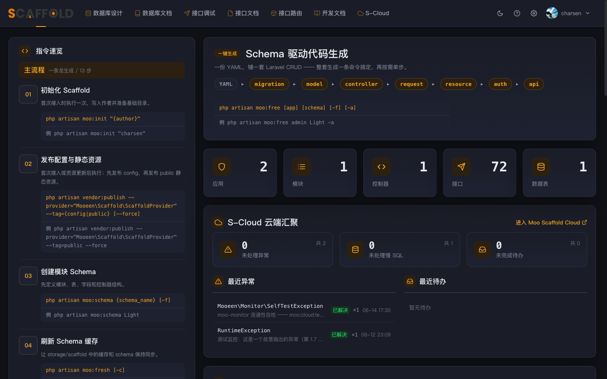

# moo-scaffold

> **Laravel 后端代码生成器 + 开发辅助后台。** 写一份 YAML,一条命令生成全套能直接跑的后端代码;再附一个「开发期可写、生产只读」的 `/scaffold` 开发后台。

**一个有主见的参考实现,不是开箱即用的通用脚手架。** 它沉淀了一个人多年 Laravel 的取舍——你可以拿去用,也可以只借走背后的判断。

`PHP 8.2+` · `Laravel 12` · `MIT`

---

## 一眼看懂

写 20 行 YAML:

```yaml
tables:
  books:
    model:      { class: Book }
    controller: { app: ['admin'], class: BookController }
    fields:
      id:     {}
      title:  { name: 书名, type: varchar, size: '2,200' }
      status: { name: 状态, type: tinyint, default: 7 }
    enums:
      status: { draft: [2, draft, 草稿], published: [7, published, 已发布] }
```

跑一条 `php artisan moo:free admin Book -a`,生成一整套**能直接 commit 的代码**(不是占位脚手架):

> `Book` model + Filter + Factory · `books` migration · `BookController`(CRUD + 批量 + 软删恢复)+ 路由自动挂载 · Store/Update Request(校验规则从字段长度 / 枚举推导)· `BookResource` · 接口文档 YAML · ACL 权限映射(精确到动作)· i18n 多语言 · 前端 `.ts` / `.vue`

手写这些 ≈ 8 个文件、200+ 行,改一个字段要同步 6 处;这里改 YAML 重跑即可。

## 三块功能

**1. 代码生成** —— `moo:fresh` 解析 schema 到缓存,`moo:free` 一条流水线吐全套代码。模板即编码规范(`stubs/` + `src/Foundation/`),生成的是你愿意 commit 的代码。

**2. 开发后台 `/scaffold`** —— 数据库设计器(可视化改 schema)、接口调试器(类 Postman,按路由自动识别参数)、ACL 查看、配置可视化编辑、开发文档中心(Markdown + Mermaid 流程图 + 接口 / 表深链)。**只在开发环境可写,生产一律只读。**

**3. 运行时监控** —— 异常 / 慢 SQL 自动捕获、缓冲、推送到云端统一看(由 [moo-monitor-laravel](https://github.com/charsen/moo-monitor-laravel) 提供,AI 可经 MCP 读取辅助修复)。



## 快速开始

```bash
composer require --dev charsen/moo-scaffold:^2.1
php artisan moo:init "你的名字"
php artisan vendor:publish --provider="Mooeen\\Scaffold\\ScaffoldProvider" --tag=public --force
php artisan moo:account:add admin --password=xxx --role=admin
```

还需在 `routes/admin.php` 留一行插入标记、注册 `Route::iResource` 宏。**完整前置 + 「5 分钟从 YAML 到接口」示例** → **[安装指南](docs/guide/01-install.md)**。

## 文档

| 我想… | 看这里 |
|---|---|
| 第一次装包 / 前置配置 | [安装指南](docs/guide/01-install.md) |
| 学 schema 语法 | [完整字段样例](docs/schema_demo.yaml) · [Schema 与代码生成](docs/guide/02-schema-codegen.md) |
| 命令速查(忘了 flag) | [CLI 速查](docs/guide/03-cli-reference.md) |
| 全部模块手册 | [docs/guide/](docs/guide/README.md) |
| 安全模型(dev 写 / prod 只读) | [安全模型](docs/guide/12-security.md) |
| 设计取舍 / 模块总览 | [项目总览](docs/overview.md) |
| 给包做贡献 / 跑测试 | [贡献指南](CONTRIBUTING.md) |

## 设计哲学(一句话版)

功能必须简单(能走 git 就走 git)· dev-only 写 / prod 只读 · UI 可追求完美但完美 ≠ 功能复杂 · 模板即编码规范。

展开版见 [项目总览](docs/overview.md) 与 [操作手册](docs/guide/README.md)。

## License

MIT
