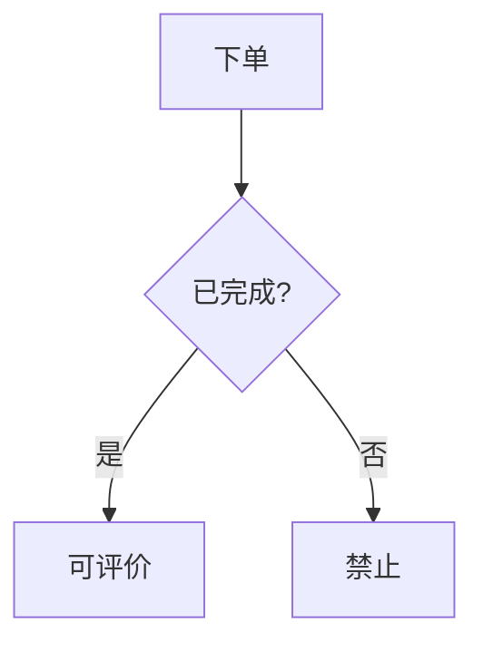

# 17 · 开发文档中心

Web 入口：`/scaffold/docs`　|　存储：`scaffold/docs/**/*.md`（入 git，随仓同步）

在 `/scaffold` 后台里写设计 / 流程 / 功能文档，能直接嵌入**接口调试 / 接口文档 / 数据库文档**的活链接（新窗口打开），并用 **Mermaid** 画流程图。文档是纯 Markdown 文件、入 git，历史走 git（无快照 / 撤销 / 审计）。

> **环境约束**：团队在**本地**编辑，**生产环境只读预览**——写操作（新建 / 编辑 / 删除）在 production 或 `SCAFFOLD_CONFIG_READONLY=true` 时一律拒绝，阅读照常。

## 写一篇文档

1. 顶栏「开发文档」→ 右上「新建」（或在某篇上点「编辑」）。
2. **路径**就是文件名（相对 `scaffold/docs/`，去掉 `.md`）。可带目录，如 `市场/订单评价流程`——目录即分组。
3. 正文用 Markdown（支持 GFM：表格 / 任务列表 / 删除线）。左边写、右边实时预览，`⌘/Ctrl+S` 保存。`Tab` 缩进 2 空格、`Shift+Tab` 反缩进（多行选中可整体缩进，写 mermaid / yaml / 列表更顺）。

也可以**直接在 IDE 里**写 `scaffold/docs/*.md`，刷新即出现——Web 编辑器只是顺手。

### 扩展包的文档(出身模型)

软链安装、带 `docs/` 目录的扩展包(如 moo-radar)会**自动**出现在左侧导航——host 分组照旧,每个包占一个 📦 折叠块,同屏一棵树,无切换器。包文档的阅读页面包屑带 `📦 包名` 徽标;编辑保存**落包仓的 `docs/`**(commit 到包仓);vendor 拷贝装的包只读(不出编辑按钮)。新建文档时若存在多个可写源,路径输入框前会出现落点下拉(`scaffold/docs/` / `[moo-radar]/docs/` …),首存后落点定死。详见 [18-package-schema.md](18-package-schema.md)。

### frontmatter（可选）

文件头可加 YAML 元数据控制标题与排序：

```markdown
---
title: 订单评价流程      # 不写则用文件名
group: 设计              # 不写则用首层目录，根目录归「未分组」
order: 10               # 组内排序，越小越靠前
tags: [设计, 流程]
---
```

## 嵌入深链 shortcode

正文里写下面这些 chip，渲染成可点按钮，新窗口打开对应页面。编辑器工具栏「接口引用 / 数据库引用」可搜索选择后**自动插入**（不用手敲、不会拼错）——搜索框里 `↑/↓` 选、`Enter` 插入，全程不用鼠标：

| 写法 | 打开 |
|---|---|
| `[[debug: admin/Market/MyMarketOrder@rate_put \| 评价调试]]` | 接口调试器（预选该接口） |
| `[[api: admin/Market/MyMarketOrder@rate_put]]` | 接口文档（定位到该接口） |
| `[[api: admin/Market/MyMarketOrder]]` | 接口文档（整个控制器，省略 `@action`） |
| `[[db: Market.market_order]]` | 数据库文档（该表） |
| `[[db: Market]]` | 数据库文档（整模块） |

- 格式：`类型: app/[Folder/]Controller@action`，省略 Folder 时默认 `Index`；`| ` 后面是可选显示名。
- `@action` 用接口的**完整 key**（带方法后缀，如 `rate_put` / `store_post`，跟接口文档里的 key 一致）。**强烈建议用工具栏「接口引用」搜索插入**——它会拼对 key，手敲容易漏后缀。
- `api:` 与 `db:` 支持**层级省略**：`api` 省 `@action` = 整个控制器；`db` 省 `.table` = 整模块。`debug` 必须带 `@action`（调试针对单个端点）。
- **表格里直接写 `|` 显示名即可**（如 `[[debug: …@rate_put | 评价调试]]`），渲染器会自动处理，不用手动转义成 `\|`。
- 目标都是只读路由，**生产环境也能点开看**。
- 写错（未知类型 / `debug` 缺 `@action`）会渲染成红色错误 chip，不会静默吞掉。

## 流程图（Mermaid）

用 ` ```mermaid ` 围栏块，源码入 git、可 diff。编辑器工具栏「流程图」插入骨架：

````markdown

````

> 实现上，流程图渲染在一个**隔离 iframe**（`/scaffold/docs/_diagram`，单独放宽 CSP）里，把 Mermaid 的运行时关在隔离帧，主站严格 CSP 不受影响。首次会加载 ~3MB 的 mermaid（按需懒加载、浏览器缓存）。

## 它不做什么

- 不做版本快照 / 多步撤销 / 操作审计——**历史走 git**（`git log` / `git restore`）。
- 不做可视化拖拽画图——Mermaid 是文本 + 实时预览。
- 不在生产环境写入——团队本地编辑、push、互相 pull。

（导出 HTML PPT 是后续计划，当前未实现。）
