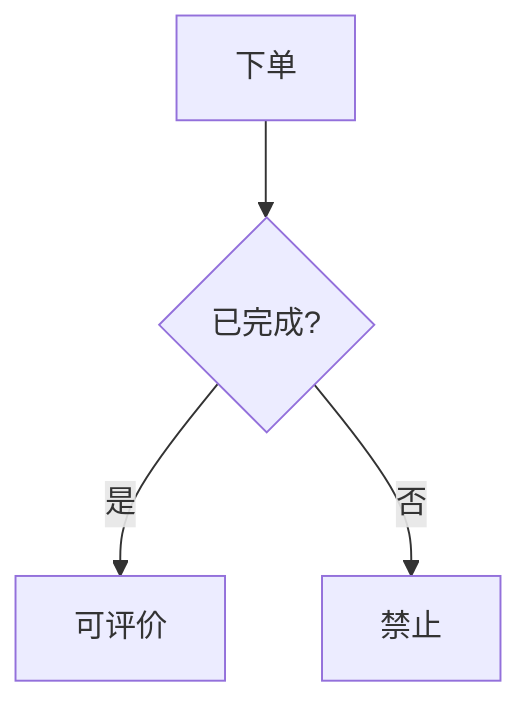

# 17 · 开发文档中心

Web 入口：`/scaffold/docs`　|　存储：`scaffold/docs/**/*.md`（入 git，随仓同步）

在 `/scaffold` 后台里写设计 / 流程 / 功能文档，能直接嵌入**接口调试 / 接口文档 / 数据库文档**的活链接（新窗口打开），并用 **Mermaid** 画流程图。文档是纯 Markdown 文件、入 git，历史走 git（无快照 / 撤销 / 审计）。

> **环境约束**：团队在**本地**编辑，**生产环境只读预览**——写操作（新建 / 编辑 / 删除）在 production 或 `SCAFFOLD_CONFIG_READONLY=true` 时一律拒绝，阅读照常。

## 写一篇文档

1. 顶栏「开发文档」→ 右上「新建」（或在某篇上点「编辑」）。
2. **路径**就是文件名（相对 `scaffold/docs/`，去掉 `.md`）。可带目录，如 `市场/订单评价流程`——目录即分组。
3. 正文用 Markdown（支持 GFM：表格 / 任务列表 / 删除线）。左边写、右边实时预览，`⌘/Ctrl+S` 保存。`Tab` 缩进 2 空格、`Shift+Tab` 反缩进（多行选中可整体缩进，写 mermaid / yaml / 列表更顺）。

也可以**直接在 IDE 里**写 `scaffold/docs/*.md`，刷新即出现——Web 编辑器只是顺手。

### 扩展包的文档(出身模型)

软链安装、带 `docs/` 目录的扩展包(如 moo-radar)会**自动**出现在左侧导航——host 分组照旧,每个包占一个 📦 折叠块,同屏一棵树,无切换器。包文档的阅读页面包屑带 `📦 包名` 徽标;编辑保存**落包仓的 `docs/`**(commit 到包仓);vendor 拷贝装的包只读(不出编辑按钮)。新建文档时若存在多个可写源,路径输入框前会出现落点下拉(`scaffold/docs/` / `[moo-radar]/docs/` …),首存后落点定死。详见 [18-package-schema.md](18-package-schema.md)。

### frontmatter（可选）

文件头可加 YAML 元数据控制标题与排序：

```markdown
---
title: 订单评价流程      # 不写则用文件名
group: 设计              # 不写则用首层目录，根目录归「未分组」
order: 10               # 组内排序，越小越靠前
tags: [设计, 流程]
---
```

## 嵌入深链 shortcode

正文里写下面这些 chip，渲染成可点按钮，新窗口打开对应页面。编辑器工具栏「接口引用 / 数据库引用」可搜索选择后**自动插入**（不用手敲、不会拼错）——搜索框里 `↑/↓` 选、`Enter` 插入，全程不用鼠标：

| 写法 | 打开 |
|---|---|
| `[[debug: admin/Market/MyMarketOrder@rate_put \| 评价调试]]` | 接口调试器（预选该接口） |
| `[[api: admin/Market/MyMarketOrder@rate_put]]` | 接口文档（定位到该接口） |
| `[[api: admin/Market/MyMarketOrder]]` | 接口文档（整个控制器，省略 `@action`） |
| `[[db: Market.market_order]]` | 数据库文档（该表） |
| `[[db: Market]]` | 数据库文档（整模块） |

- 格式：`类型: app/[Folder/]Controller@action`，省略 Folder 时默认 `Index`；`| ` 后面是可选显示名。
- `@action` 用接口的**完整 key**（带方法后缀，如 `rate_put` / `store_post`，跟接口文档里的 key 一致）。**强烈建议用工具栏「接口引用」搜索插入**——它会拼对 key，手敲容易漏后缀。
- `api:` 与 `db:` 支持**层级省略**：`api` 省 `@action` = 整个控制器；`db` 省 `.table` = 整模块。`debug` 必须带 `@action`（调试针对单个端点）。
- **表格里直接写 `|` 显示名即可**（如 `[[debug: …@rate_put | 评价调试]]`），渲染器会自动处理，不用手动转义成 `\|`。
- 目标都是只读路由，**生产环境也能点开看**。
- 写错（未知类型 / `debug` 缺 `@action`）会渲染成红色错误 chip，不会静默吞掉。

## 流程图（Mermaid）

用 ` ```mermaid ` 围栏块，源码入 git、可 diff。编辑器工具栏「流程图」插入骨架：

````markdown

```mermaid
flowchart TD
  A[下单] --> B{已完成?}
  B -- 是 --> C[可评价]
  B -- 否 --> D[禁止]
```
````

> 实现上，流程图渲染在一个**隔离 iframe**（`/scaffold/docs/_diagram`，单独放宽 CSP）里，把 Mermaid 的运行时关在隔离帧，主站严格 CSP 不受影响。首次会加载 ~3MB 的 mermaid（按需懒加载、浏览器缓存）。

## 它不做什么

- 不做版本快照 / 多步撤销 / 操作审计——**历史走 git**（`git log` / `git restore`）。
- 不做可视化拖拽画图——Mermaid 是文本 + 实时预览。
- 不在生产环境写入——团队本地编辑、push、互相 pull。

（导出 HTML PPT 是后续计划，当前未实现。）

## 发版日志

主菜单「发版日志」进入 `/scaffold/release-records`，登录后浏览 Host 的 Markdown 发版记录。默认配置为 `../release-records`：Laravel 工程位于 `engine/` 时直接读取仓库根目录的 `release-records/**/*.md`，无需设置环境变量。本地环境支持编辑既有文件，不提供新建、删除或重排操作。

自定义目录可通过 `scaffold.release_records.path` 配置（环境变量 `SCAFFOLD_RELEASE_RECORDS_PATH`），支持相对 Laravel 根目录或绝对路径。读取类只使用配置值，不探测或回退到 `engine/release-records`，不合并多个目录。目录不存在时显示空态，不自动创建目录。Laravel 工程直接位于仓库根目录的其他布局，可显式配置 `release-records`。

推荐结构为 `release-records/YYYY-MMDD-描述/tag.md`，也支持 `YYYY-MM-DD-描述`。按目录日期倒序，同日多份记录分别保留并按路径稳定倒序；未标注日期的文件排在末尾，不使用文件修改时间推断发布日期。未配置 frontmatter 时，标题取 Markdown 一级标题，没有标题则显示相对文件路径。默认打开最新一篇，侧栏可过滤标题，正文支持现有 Markdown 表格、代码高亮与 Mermaid。编辑器 HTML 注释在阅读时隐藏，源文件保持原样。

只读取配置目录内的 Markdown，隐藏目录/文件、下划线开头的草稿和指向目录外的软链不显示。发版记录内容代表文件中的记录，不自动核验 Git 标签或服务器部署状态。

## 研发计划

主菜单「研发计划」进入 `/scaffold/plans`，登录后浏览 Host 的 `plans/**/*.md`。`scaffold.plans.path` 默认值为 `../plans`，Laravel 工程位于 `engine/` 时直接读取仓库根目录的计划，无需设置环境变量。读取类不探测或回退到 `engine/plans`，即使该目录存在旧副本也不会读取。自定义时可通过 `SCAFFOLD_PLANS_PATH` 指定相对 Laravel 根目录或绝对路径；Laravel 工程直接位于仓库根目录的其他布局，可显式配置 `plans`。

默认打开根 `README.md`；缺少索引时打开排序后的第一篇。未配置 frontmatter 时，侧栏按目录分组、文件名自然排序（2 在 10 前），支持标题过滤，`archive/` 等子目录独立展示。空目录或目录不存在时显示空态，不创建文件。

目录内 Markdown 相对链接会转换成阅读页链接，支持中文路径、`../` 返回上层及章节片段。标题生成小写、空格转短横线并去除标点的稳定锚点；重复标题追加数字后缀。不存在、越出 plans 或指向非 Markdown 的相对链接保留文字并禁用点击。外部 URL 保留既有安全 Markdown 渲染行为；图片和其他本地附件不提供文件读取接口。

仅扫描非隐藏、非下划线前缀的 Markdown 文件，拒绝读取指向配置目录外的软链。本地环境支持编辑既有文件，界面不提供新建、删除和重排；文档内的完成记录不代表当前 Git 或部署状态。

### 本地编辑计划与发版日志

仅当 `APP_ENV=local`、`SCAFFOLD_CONFIG_READONLY` 未启用，且当前文件与所在目录可写时显示「编辑」。指向配置目录内的软链仍可阅读，但不显示编辑入口。进入编辑页后，左侧修改原始 Markdown、右侧实时预览，点击「保存」或 `⌘/Ctrl+S` 写回原文件；输入和预览不会自动保存。返回阅读或关闭页面前，有未保存内容时浏览器会提醒。

编辑不重写 frontmatter、HTML 注释或首尾空白；阅读和预览继续隐藏 HTML 注释。保存时若文件已被其他编辑器修改，返回冲突并保留当前输入，需要重新打开文件后合并修改。保存只接受配置目录内已存在的 Markdown，拒绝隐藏、下划线前缀文件、软链文件/目录与路径穿越，不会创建文件或改变文件路径。

保存请求超过 15 秒未收到响应时提示结果尚未确认，断网或请求失败也会保留输入并恢复保存按钮。可以直接重试：若上次已写入且文件内容与本次提交完全相同，返回成功，不重复替换文件；内容不同则继续校验版本并拒绝冲突。

编辑页面与保存/预览接口均保留 Scaffold 登录保护；写接口校验 CSRF、专用 Request 和文件边界。非 local 环境（包括 staging、production）或强制只读时，编辑页和接口拒绝访问，阅读照常。

### 计划与发版日志的 frontmatter

两类记录都支持文件顶部的 YAML frontmatter，沿用开发文档的字段：

```yaml
---
title: 本次迭代计划
group: 进行中
order: 10
tags: [后端, 迭代]
---
```

- `title`：侧栏和阅读栏标题；未填写时继续取正文一级标题，再回退文件路径。
- `group`：计划的侧栏分组；未填写时使用原目录分组。发版日志在日期后显示自定义分组，日期仍来自文件路径。
- `order`：整数，越小越靠前，未填写时为 999。计划按组内最小 order 排组，再按 group、order、自然文件名排序，根 `README.md` 仍优先打开；发版日志先按日期倒序，同日再按 order、路径倒序。
- `tags`：字符串列表，也支持中英文逗号分隔，在阅读栏显示标签。

支持空头部、UTF-8 BOM 和 CRLF 换行；头部须以独立一行的 `---` 结束。阅读和预览只渲染已闭合头部之后的正文，不显示 YAML 头部；缺少结束标记时保留原文展示。编辑器显示完整原文，可直接修改 frontmatter；保存不会重新 dump YAML，BOM、换行和其他自定义元数据原样保留。

阅读时容忍格式错误或非对象的 YAML，元数据按缺省值处理；编辑时显示语法错误行号或无效字段提示，并拒绝保存，直到修复。`order` 接受整数或整数字符串，布尔值、小数和其他类型无效。
